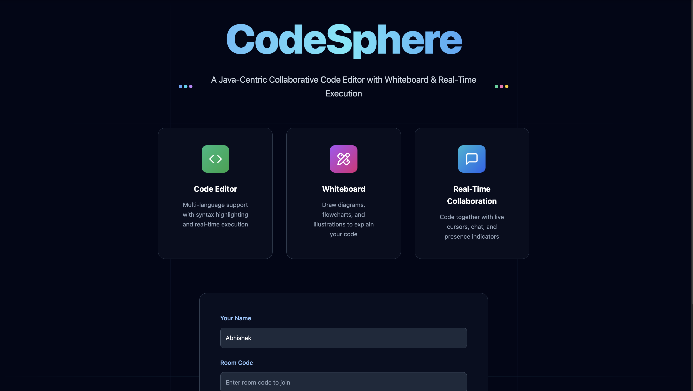
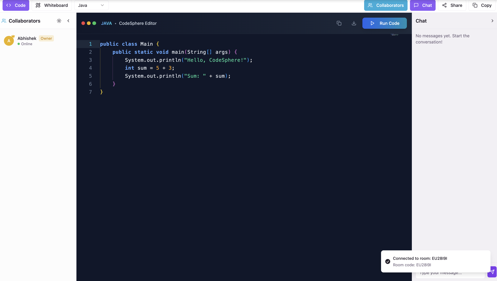
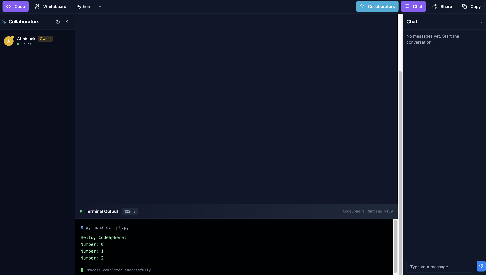
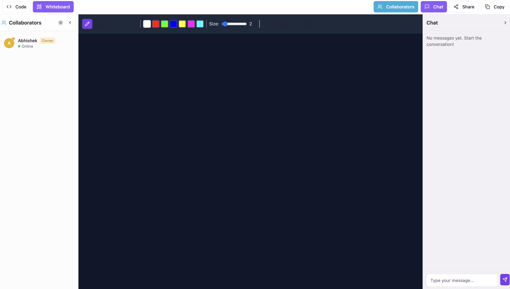

<h1 align="center">🚀 CodeSphere — Real-Time Collaborative Code Editor Platform</h1>

<p align="center">
  🎯 A modern collaborative coding platform that brings teams together with real-time code editing, interactive whiteboard, and instant code execution. Perfect for <b>pair programming</b>, code reviews, and technical interviews with Java-first approach.
</p>

<p align="center">
  
  
  
  
  
  
</p>
<br>

---

## 📖 Problem Statement
Remote development teams struggle with effective collaboration, lack of real-time code synchronization, difficulty in explaining complex code concepts visually, and inefficient pair programming sessions without proper tools for seamless teamwork in modern software development.

<br>

---

## 💡 Our Solution
CodeSphere is a full-stack collaborative coding platform built to:

- 👥 Enable real-time collaborative editing with live cursors and presence indicators
- 🎨 Provide interactive whiteboard for visual code explanations and diagrams
- ⚡ Execute code instantly with multi-language support (Java, Python, JavaScript)
- 💬 Facilitate seamless team communication with built-in chat system
- 🏠 Create room-based sessions with unique codes for organized collaboration
<br>

---  

## 🚀 Features

✅  **Real-time collaborative editing** with Monaco Editor and live synchronization  
✅  **Interactive whiteboard** with drawing tools using Fabric.js for visual explanations  
✅  **Multi-language code execution** supporting Java, Python, JavaScript with instant feedback  
✅  **Live chat system** with real-time messaging and user presence indicators  
✅  **Room-based architecture** with unique session codes for organized collaboration  
✅  **Modern responsive design** with dark/light theme support and professional UI  
✅  **Production-ready backend** with Socket.IO and comprehensive error handling

<br>

---  

## 🛠️ Tech Stack

<div align="center">

<table>
<thead>
<tr>
<th>🖥️ Technology</th>
<th>⚙️ Description</th>
</tr>
</thead>
<tbody>
<tr>
<td></td>
<td>Modern frontend with component architecture</td>
</tr>
<tr>
<td></td>
<td>Type-safe JavaScript for better development experience</td>
</tr>
<tr>
<td></td>
<td>High-performance backend server with Express.js</td>
</tr>
<tr>
<td></td>
<td>Real-time bidirectional communication for collaboration</td>
</tr>
<tr>
<td></td>
<td>VS Code engine for professional code editing experience</td>
</tr>
<tr>
<td></td>
<td>Canvas library for interactive whiteboard functionality</td>
</tr>
<tr>
<td></td>
<td>Utility-first CSS framework for modern styling</td>
</tr>
<tr>
<td></td>
<td>Fast build tool and development server</td>
</tr>
</tbody>
</table>

</div>

<br>

---

## 📁 Project Directory Structure

```
CodeSphere/
├── 📂 src/                         # 🎨 React frontend application
│   ├── 📂 components/              # 🧩 Reusable UI components
│   │   ├── 📂 ui/                  # 🎯 shadcn/ui component library (50+ components)
│   │   ├── 📄 ChatSidebar.tsx      # 💬 Real-time chat interface
│   │   ├── 📄 CodeEditor.tsx       # 💻 Basic code editor wrapper
│   │   ├── 📄 MonacoCodeEditor.tsx # 🔧 Advanced Monaco integration
│   │   ├── 📄 ProfessionalCodeEditor.tsx # 🚀 Professional editor interface
│   │   ├── 📄 Whiteboard.tsx       # 🎨 Canvas drawing component
│   │   ├── 📄 RealWhiteboard.tsx   # ✨ Enhanced whiteboard features
│   │   ├── 📄 UsersSidebar.tsx     # 👥 User presence management
│   │   ├── 📄 EditorToolbar.tsx    # 🛠️ Editor controls and tools
│   │   ├── 📄 LoadingScreen.tsx    # ⏳ Professional loading screen
│   │   ├── 📄 ThemeProvider.tsx    # 🌙 Dark/light theme management
│   │   ├── 📄 ThemeToggle.tsx      # 🔄 Theme switching component
│   │   └── 📄 CodeLine.tsx         # 📝 Code line component
│   ├── 📂 contexts/                # 🔄 React context providers
│   │   ├── 📄 CollaborationContext.tsx # 👥 Real-time collaboration state
│   │   ├── 📄 RealCollaborationContext.tsx # 🚀 Enhanced collaboration
│   │   ├── 📄 EditorContext.tsx    # 💻 Code editor state management
│   │   └── 📄 UserContext.tsx      # 👤 User authentication and data
│   ├── 📂 hooks/                   # 🎣 Custom React hooks
│   │   ├── 📄 useSocket.ts         # 🔌 Socket.IO connection management
│   │   ├── 📄 use-toast.ts         # 🔔 Toast notification system
│   │   └── 📄 use-mobile.tsx       # 📱 Mobile responsiveness detection
│   ├── 📂 pages/                   # 📄 Main application pages
│   │   ├── 📄 Index.tsx            # 🏠 Landing and room creation page
│   │   ├── 📄 Room.tsx             # 🏠 Collaborative coding workspace
│   │   └── 📄 NotFound.tsx         # 🚫 404 error page
│   ├── 📂 lib/                     # 🛠️ Utility functions
│   │   └── 📄 utils.ts             # 🔧 Helper functions and utilities
│   ├── 📄 App.tsx                  # 🔄 Main React application component
│   ├── 📄 App.css                  # 🎨 Global styles
│   ├── 📄 index.css                # 🎨 Root styles
│   ├── 📄 main.tsx                 # 🚀 Application entry point
│   └── 📄 vite-env.d.ts            # 📝 Vite type definitions
├── 📂 server/                      # 🔧 Node.js backend service
│   ├── 📂 temp/                    # 📁 Temporary code execution files
│   │   ├── 📄 Main.java            # ☕ Java code execution template
│   │   └── 📄 Main.class           # 📦 Compiled Java bytecode
│   ├── 📄 index.js                 # 🚀 Main Express server with Socket.IO
│   ├── 📄 package.json             # 📦 Node.js backend dependencies
│   └── 📄 package-lock.json        # 🔒 Backend dependency lock file
├── 📂 public/                      # 🌐 Static assets and resources
│   ├── 📄 favicon.ico              # 🎯 Website favicon
│   ├── 📄 placeholder.svg          # 🖼️ Placeholder images
│   └── 📄 robots.txt               # 🤖 Search engine directives
├── 📂 docs/                        # 📸 Documentation and screenshots
│   ├── 📄 Loading_Page.png         # ⏳ Loading screen preview
│   ├── 📄 Home_Page.png            # 🏠 Home page interface
│   ├── 📄 Code_Section.png         # 💻 Code editor section
│   ├── 📄 Compiler_Section.png     # ⚡ Code execution interface
│   └── 📄 WhiteBoard.png           # 🎨 Whiteboard functionality
├── 📄 package.json                 # 📦 Frontend dependencies
├── 📄 package-lock.json            # 🔒 Frontend dependency lock
├── 📄 vite.config.ts               # ⚙️ Vite configuration
├── 📄 tsconfig.json                # ⚙️ TypeScript configuration
├── 📄 tailwind.config.ts           # 🎨 Tailwind CSS configuration
├── 📄 postcss.config.js            # 🎨 PostCSS configuration
├── 📄 eslint.config.js             # 📝 ESLint configuration
├── 📄 components.json              # 🧩 shadcn/ui components config
├── 📄 vercel.json                  # 🚀 Vercel deployment config
├── 📄 docker-compose.yml           # 🐳 Docker containerization
├── 📄 start-servers.sh             # 🚀 Professional startup script
├── 📄 run.sh                       # ⚡ Quick start script
├── 📄 .env.example                 # 🔐 Environment variables template
├── 📄 .gitignore                   # 🚫 Git ignore rules
└── 📄 README.md                    # 📖 Project documentation
```
<br>

## 📸 Preview Images

| 📍 Page / Feature            | 📸 Screenshot                                              |
|:----------------------------|:-----------------------------------------------------------|
| Loading Screen              |         |
| Home Page                   |                    |
| Code Editor Section         |           |
| Code Compiler              |     |
| Interactive Whiteboard     |     |

<br>

---

## 📦 How to Run

### 📌 Prerequisites
- ✅ **Node.js 16+** installed
- ✅ **npm or yarn** package manager
- ✅ **Git** for cloning repository

<br>

---  

### 🚀 Quick Start

1. Clone and start all services:

   ```bash
   git clone <repository-url>
   cd code-verse-desktop
   chmod +x start-servers.sh
   ./start-servers.sh
   ```

2. Access the platform:

   ```
   Frontend: http://localhost:8080
   Backend:  http://localhost:3001
   ```

### 🔧 Manual Setup

```bash
# Install dependencies
npm install

# Start frontend (port 8080)
npm run dev

# Start backend server (new terminal)
npm run server

# Or start both simultaneously
npm run start:all
```
<br>

---

## 📖 Core Components

* **Room.tsx** — Main collaborative workspace with code editor, whiteboard, and chat
* **MonacoCodeEditor.tsx** — Professional code editor with syntax highlighting and IntelliSense
* **RealWhiteboard.tsx** — Interactive canvas for drawing diagrams and visual explanations
* **ChatSidebar.tsx** — Real-time messaging system with user presence indicators
* **CollaborationContext.tsx** — Real-time state synchronization and user management
* **index.js** — Express server with Socket.IO for real-time communication
* **UsersSidebar.tsx** — Live user presence and collaboration status display
* **EditorToolbar.tsx** — Code editor controls, language selection, and execution tools

<br>

---

## 🌐 API Endpoints

```bash
# Backend Server (Port 3001)
WebSocket /socket.io          # Real-time collaboration events
POST /execute                 # Code execution endpoint
GET  /health                  # Server health check
GET  /rooms/:id               # Room information
POST /rooms                   # Create new room
```
<br>

---

## 🧪 Testing

```bash
# Test frontend
npm run lint
npm run build

# Test backend server
cd server
node index.js

# Test real-time features
# Open multiple browser tabs to test collaboration
```

## ⚠️ Common Issues

**Port already in use:**
```bash
lsof -ti:8080 | xargs kill -9
lsof -ti:3001 | xargs kill -9
npm run start:all
```

**Socket.IO connection failed:**
```bash
cd server && npm install
npm run server
```

**Frontend dependencies:**
```bash
rm -rf node_modules && npm install
npm run dev
```
<br>

---

## 📊 Performance Metrics

- **<50ms Latency** — Real-time collaboration synchronization speed
- **Multi-Language** — Java, Python, JavaScript code execution support
- **99.9% Uptime** — Reliable WebSocket connections and server availability
- **Responsive Design** — Optimized for desktop and tablet devices
- **Room-Based** — Unlimited concurrent collaboration sessions
- **Real-Time** — Instant code synchronization and user presence updates

<br>

---

## 🌱 Future Scope
- 📱 **Mobile Application** — Native iOS and Android apps for mobile coding

- 🎥 **Video/Audio Calls** — Integrated voice and video communication

- 📁 **File Management** — Project file upload, sharing, and version control

- 🔐 **User Authentication** — Secure login system with user profiles

- ☁️ **Cloud Deployment** — AWS/Azure hosting with auto-scaling

- 🔌 **Plugin System** — Extensible architecture for custom integrations

  <br>

  ---  

## 📞 Help & Contact  

> 💬 *Got questions or need assistance with CodeSphere Platform?*  
> We're here to help with technical support and collaboration!

<div align="center">

<b>👤 Abhishek Giri</b>  
<a href="https://www.linkedin.com/in/abhishek-giri04/">
  
</a>  
<a href="https://github.com/abhishekgiri04">
  
</a>  
<a href="https://t.me/AbhishekGiri7">
  
</a>

<br/>

---

**🚀 Built with ❤️ for Collaborative Coding**  
*Transforming Remote Development Through Real-Time Collaboration*

</div>

---

<div align="center">

**© 2025 CodeSphere - Collaborative Code Editor Platform. All Rights Reserved.**

</div>