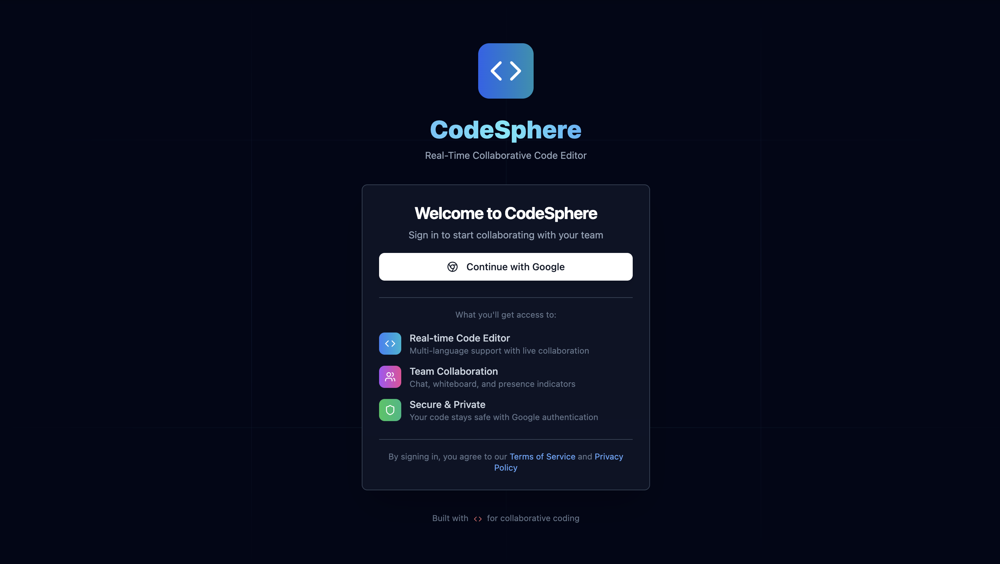
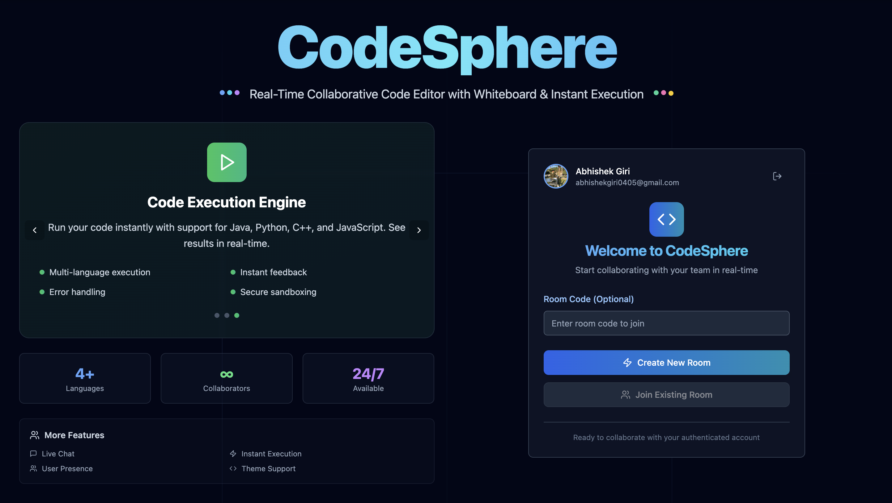
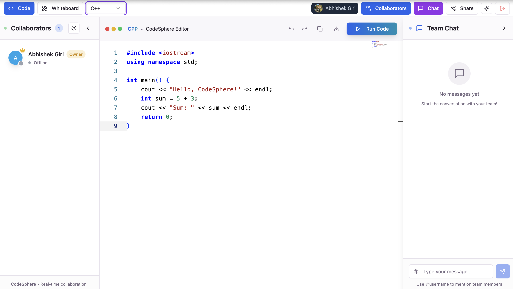
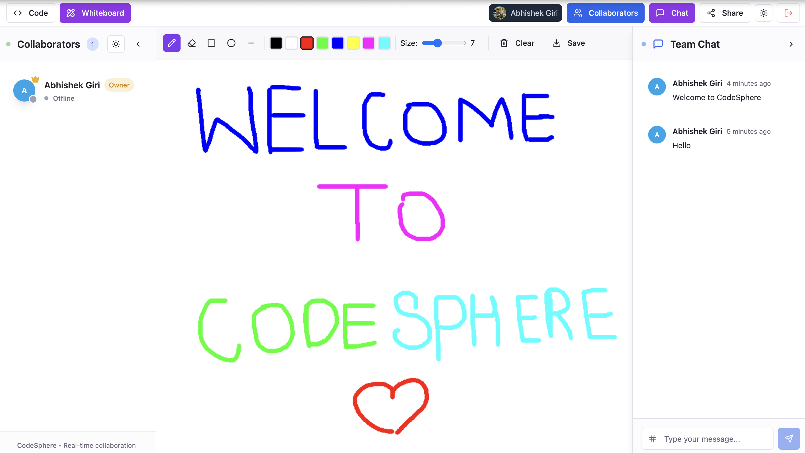
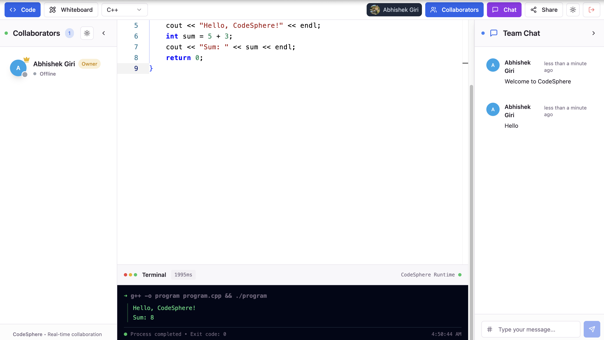
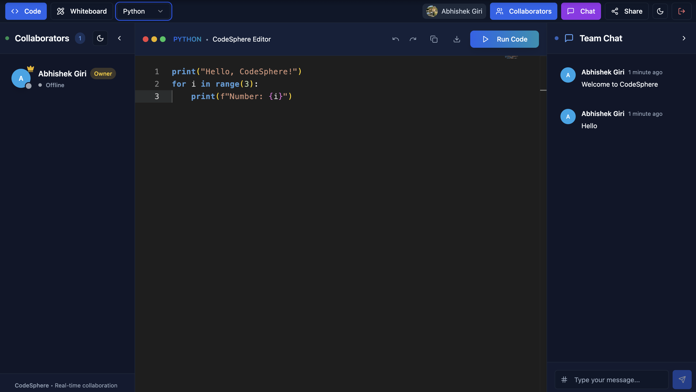
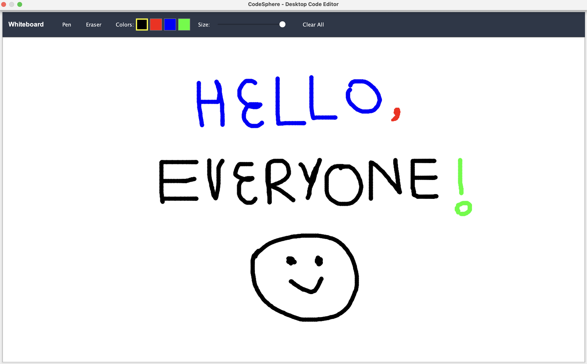
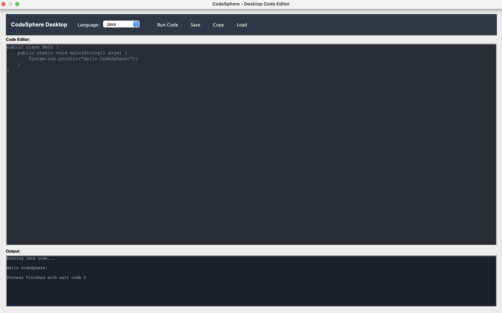

<h1 align="center">🚀 CodeSphere — Real-Time Collaborative Code Editor Platform</h1>

<p align="center">
  🎯 A modern collaborative coding platform that brings teams together with real-time code editing, interactive whiteboard, and instant code execution. Perfect for <b>pair programming</b>, code reviews, and technical interviews with Java-first approach.
</p>

<p align="center">
  
  
  
  
  
  
</p>
<br>

---

## 📖 Project Overview
CodeSphere is a comprehensive collaborative coding platform designed for modern development teams. It combines real-time code editing, visual collaboration tools, and instant code execution in both web and desktop environments. Built with React and Java Swing, it provides seamless collaboration experiences for remote teams, coding interviews, and educational purposes.

<br>

---

## 💡 Key Features

- 👥 **Real-time Collaboration** — Live code editing with cursor tracking and user presence
- 🎨 **Interactive Whiteboard** — Visual explanations with drawing tools and shapes
- ⚡ **Multi-language Execution** — Instant code compilation for Java, Python, JavaScript, C++
- 💬 **Team Chat System** — Built-in messaging with @mentions and notifications
- 🏠 **Room Management** — Unique session codes for organized collaboration
- 🖥️ **Dual Platform** — Web application and desktop Java Swing version
- 🔐 **Secure Authentication** — Firebase-powered user management
- 📱 **Responsive Design** — Optimized for desktop, tablet, and mobile devices
- 🎯 **Professional UI** — Monaco Editor with VS Code-like experience
- 🔄 **Real-time Sync** — Instant synchronization across all connected users

<br>

---  

## 🚀 Live Demo

✅  **Web Application** — Experience CodeSphere in your browser  
✅  **Desktop Version** — Full-featured Java Swing application  
✅  **Real-time Collaboration** — Multi-user editing and whiteboard  
✅  **Code Execution** — Live compiler for multiple programming languages  
✅  **Room-based Sessions** — Organized collaboration with unique codes  
✅  **Cross-platform** — Works on Windows, macOS, and Linux  
✅  **Professional Tools** — Monaco Editor with syntax highlighting  
✅  **Visual Collaboration** — Interactive whiteboard with drawing tools  
✅  **Team Communication** — Built-in chat with user presence  
✅  **Secure & Fast** — Firebase authentication and optimized performance

<br>

---  

## 🛠️ Tech Stack

<div align="center">

<table>
<thead>
<tr>
<th>🖥️ Technology</th>
<th>⚙️ Description</th>
</tr>
</thead>
<tbody>
<tr>
<td></td>
<td>Modern frontend with component architecture and hooks</td>
</tr>
<tr>
<td></td>
<td>Type-safe JavaScript for better development experience</td>
</tr>
<tr>
<td></td>
<td>High-performance backend server with Express.js</td>
</tr>
<tr>
<td></td>
<td>Real-time bidirectional communication for collaboration</td>
</tr>
<tr>
<td></td>
<td>Desktop application with Swing UI and real compiler</td>
</tr>
<tr>
<td></td>
<td>VS Code engine for professional code editing experience</td>
</tr>
<tr>
<td></td>
<td>Canvas library for interactive whiteboard functionality</td>
</tr>
<tr>
<td></td>
<td>Authentication, real-time database, and hosting</td>
</tr>
<tr>
<td></td>
<td>Utility-first CSS framework for modern styling</td>
</tr>
<tr>
<td></td>
<td>Fast build tool and development server</td>
</tr>
</tbody>
</table>

</div>

<br>

---

## 📸 Application Screenshots

### Web Application Interface
<table>
  <tr>
    <td><br/><b>Loading Screen</b></td>
    <td><br/><b>Sign In Page</b></td>
  </tr>
  <tr>
    <td><br/><b>Home Page</b></td>
    <td><br/><b>Code Editor</b></td>
  </tr>
</table>

### Collaboration & Features
<table>
  <tr>
    <td><br/><b>Web Whiteboard</b></td>
    <td><br/><b>Code Execution Terminal</b></td>
  </tr>
  <tr>
    <td><br/><b>Dark Mode Interface</b></td>
  </tr>
</table>

### Desktop Application
<table>
  <tr>
    <td><br/><b>Desktop Whiteboard</b></td>
    <td><br/><b>Desktop Code Editor</b></td>
  </tr>
</table>

## 📁 Project Structure

```
CodeSphere/
├── 📂 docs/                         # 📸 Screenshots and documentation
│   ├── 📄 LoadingPage.png           # ⏳ Loading screen interface
│   ├── 📄 SignIn.png                # 🔑 Authentication page
│   ├── 📄 HomePage.png              # 🏠 Home page interface
│   ├── 📄 CodeSection.png           # 💻 Code editor section
│   ├── 📄 Web_WhiteBoard.png        # 🎨 Web whiteboard functionality
│   ├── 📄 Terminal.png              # ⚡ Code execution terminal
│   ├── 📄 DarkMode.png              # 🌙 Dark mode interface
│   ├── 📄 Desktop_CodeSphere.png    # 🖥️ Desktop application
│   └── 📄 Desktop_WhiteBoard.png    # 🎨 Desktop whiteboard
├── 📂 server/                       # 🔧 Node.js backend service
│   ├── 📄 index.js                  # 🚀 Express server with Socket.IO
│   ├── 📄 package.json              # 📦 Server dependencies
│   └── 📄 package-lock.json         # 🔒 Server dependency lock
├── 📂 src/                          # 🎨 React frontend application
│   ├── 📂 components/               # 🧩 Reusable UI components
│   │   ├── 📂 ui/                   # 🎯 shadcn/ui component library
│   │   │   ├── 📄 alert.tsx              # 🚨 Alert components
│   │   │   ├── 📄 button.tsx             # 🔘 Button components
│   │   │   ├── 📄 card.tsx               # 📋 Card components
│   │   │   ├── 📄 dialog.tsx             # 💬 Dialog components
│   │   │   ├── 📄 input.tsx              # 📝 Input components
│   │   │   ├── 📄 label.tsx              # 🏷️ Label components
│   │   │   ├── 📄 scroll-area.tsx        # 📜 Scroll area components
│   │   │   ├── 📄 select.tsx             # 📋 Select components
│   │   │   ├── 📄 separator.tsx          # ➖ Separator components
│   │   │   ├── 📄 sheet.tsx              # 📄 Sheet components
│   │   │   ├── 📄 skeleton.tsx           # 💀 Loading skeleton
│   │   │   ├── 📄 sonner.tsx             # 🔔 Toast notifications
│   │   │   ├── 📄 toast.tsx              # 🍞 Toast components
│   │   │   ├── 📄 toaster.tsx            # 🔔 Toast container
│   │   │   ├── 📄 toggle.tsx             # 🔄 Toggle components
│   │   │   └── 📄 tooltip.tsx            # 💡 Tooltip components
│   │   ├── 📄 AuthScreen.tsx        # 🔑 Authentication interface
│   │   ├── 📄 ChatSidebar.tsx       # 💬 Real-time chat interface
│   │   ├── 📄 EditorToolbar.tsx     # 🛠️ Editor controls and tools
│   │   ├── 📄 FeaturesShowcase.tsx  # ✨ Features demonstration
│   │   ├── 📄 GoogleAuth.tsx        # 🔐 Google authentication
│   │   ├── 📄 LoadingScreen.tsx     # ⏳ Professional loading screen
│   │   ├── 📄 ProfessionalCodeEditor.tsx # 🚀 Monaco editor integration
│   │   ├── 📄 ProfessionalFooter.tsx # 🔻 Footer component
│   │   ├── 📄 ProtectedRoute.tsx    # 🛡️ Route protection
│   │   ├── 📄 RealWhiteboard.tsx    # ✨ Interactive whiteboard
│   │   ├── 📄 ThemeProvider.tsx     # 🌙 Theme management
│   │   ├── 📄 ThemeToggle.tsx       # 🌓 Dark/light theme toggle
│   │   └── 📄 UsersSidebar.tsx      # 👥 User presence management
│   ├── 📂 contexts/                 # 🔄 React context providers
│   │   ├── 📄 AuthContext.tsx       # 🔐 Authentication state
│   │   ├── 📄 CollaborationContext.tsx # 👥 Real-time collaboration
│   │   ├── 📄 EditorContext.tsx     # 💻 Code editor state
│   │   └── 📄 UserContext.tsx       # 👤 User data management
│   ├── 📂 hooks/                    # 🎣 Custom React hooks
│   │   └── 📄 use-toast.ts          # 🔔 Toast notification system
│   ├── 📂 lib/                      # 🛠️ Utility functions
│   │   ├── 📄 firebase.ts           # 🔥 Firebase configuration
│   │   └── 📄 utils.ts              # 🔧 Helper functions
│   ├── 📂 main/java/                # ☕ Java desktop application
│   │   └── 📂 com/codesphere/       # 📦 Java package structure
│   │       └── 📄 CodeSphereSwing.java # 🖥️ Desktop application
│   ├── 📂 pages/                    # 📄 Main application pages
│   │   ├── 📄 Index.tsx             # 🏠 Landing and room creation
│   │   ├── 📄 Room.tsx              # 🏠 Collaborative workspace
│   │   └── 📄 NotFound.tsx          # 🚫 404 error page
│   ├── 📄 App.tsx                   # 🔄 Main React component
│   ├── 📄 App.css                   # 🎨 Global styles
│   ├── 📄 index.css                 # 🎨 Base styles
│   ├── 📄 main.tsx                  # 🚀 Application entry point
│   └── 📄 vite-env.d.ts             # 🔧 Vite type definitions
├── 📂 target/                       # 📦 Java compiled classes
│   ├── 📂 classes/                  # 🏗️ Compiled Java bytecode
│   ├── 📂 generated-sources/        # 🔄 Generated source files
│   └── 📂 maven-status/             # 📊 Maven build status
├── 📄 package.json                  # 📦 Frontend dependencies
├── 📄 package-lock.json             # 🔒 Dependency lock file
├── 📄 pom.xml                       # ☕ Maven configuration
├── 📄 vite.config.ts                # ⚙️ Vite build configuration
├── 📄 tailwind.config.ts            # 🎨 Tailwind CSS configuration
├── 📄 components.json               # 🧩 shadcn/ui configuration
├── 📄 eslint.config.js              # 📏 ESLint configuration
├── 📄 tsconfig.json                 # 🔧 TypeScript configuration
├── 📄 tsconfig.app.json             # 🔧 App TypeScript config
├── 📄 tsconfig.node.json            # 🔧 Node TypeScript config
├── 📄 postcss.config.js             # 🎨 PostCSS configuration
├── 📄 vercel.json                   # 🚀 Vercel deployment config
├── 📄 index.html                    # 🌐 HTML template
├── 📄 run.sh                        # 🌐 Web application startup
├── 📄 start-swing.sh                # 🖥️ Desktop application startup
├── 📄 .env                          # 🔐 Environment variables (local)
├── 📄 .env.example                  # 🔧 Environment variables template
├── 📄 .gitignore                    # 🚫 Git ignore rules
└── 📄 README.md                     # 📖 Project documentation
```
<br>

---

## 📦 Installation & Setup

### 📌 Prerequisites
- ✅ **Node.js 16+** installed
- ✅ **Java 11+** for desktop application
- ✅ **Maven 3.6+** for Java compilation
- ✅ **Firebase account** for authentication
- ✅ **Git** for version control

<br>

---  

### 🚀 Quick Start

1. **Clone the repository:**

   ```bash
   git clone https://github.com/abhishekgiri04/CodeSphere.git
   cd CodeSphere
   ```

2. **Configure environment:**

   ```bash
   cp .env.example .env
   # Add your Firebase configuration to .env file
   ```

3. **Start web application:**

   ```bash
   chmod +x run.sh
   ./run.sh
   ```

4. **Start desktop application:**

   ```bash
   chmod +x start-swing.sh
   ./start-swing.sh
   ```

5. **Access the applications:**

   ```
   Web App: http://localhost:8080
   Backend: http://localhost:3001
   Desktop: Java Swing GUI
   ```

### 🔧 Environment Setup

Create `.env` file in root directory:

```env
# Firebase Configuration
VITE_FIREBASE_API_KEY=your_api_key_here
VITE_FIREBASE_AUTH_DOMAIN=your_project.firebaseapp.com
VITE_FIREBASE_PROJECT_ID=your_project_id
VITE_FIREBASE_STORAGE_BUCKET=your_project.appspot.com
VITE_FIREBASE_MESSAGING_SENDER_ID=your_sender_id
VITE_FIREBASE_APP_ID=your_app_id
VITE_FIREBASE_MEASUREMENT_ID=your_measurement_id

# Server Configuration
PORT=3001
NODE_ENV=development
```
<br>

---

## 🎯 Core Features

### 👥 Real-time Collaboration
- **Live Code Editing** → Multiple users editing simultaneously
- **Cursor Tracking** → See where team members are working
- **User Presence** → Real-time user status and activity
- **Instant Sync** → Changes reflected immediately across all clients

### 🎨 Interactive Whiteboard
- **Drawing Tools** → Pen, eraser, shapes, and colors
- **Real-time Drawing** → Collaborative visual explanations
- **Save & Load** → Persistent whiteboard sessions
- **Multi-user Canvas** → Multiple users drawing simultaneously

### ⚡ Code Execution
- **Multi-language Support** → Java, Python, JavaScript, C++
- **Real Compilation** → Actual compiler integration
- **Instant Results** → Fast code execution and output
- **Error Handling** → Comprehensive error reporting

### 💬 Team Communication
- **Built-in Chat** → Real-time messaging system
- **@Mentions** → Tag team members in conversations
- **User Notifications** → Message alerts and updates
- **Chat History** → Persistent conversation logs

<br>

---

## 🌐 API Integration

```bash
# Backend Services
Socket.IO Server    # Real-time collaboration
Express.js API      # REST endpoints
Firebase Auth       # User authentication
Firebase Firestore  # Data persistence

# Code Execution
Java Compiler       # javac command integration
Python Interpreter  # python3 command
Node.js Runtime     # node command
G++ Compiler        # g++ command integration
```
<br>

---

## 🧪 Testing & Development

```bash
# Web Application
npm run dev          # Start development server
npm run build        # Build for production
npm run lint         # Code linting
npm run preview      # Preview production build

# Desktop Application
mvn clean compile    # Compile Java code
mvn exec:java        # Run desktop app
mvn package          # Create executable JAR

# Server
cd server
npm start            # Start backend server
npm run dev          # Start with nodemon
```

## ⚠️ Common Issues

**Firebase connection failed:**
```bash
# Check your .env file configuration
# Ensure Firebase project is properly set up
# Verify API keys are correct and have proper permissions
```

**Java compilation errors:**
```bash
# Ensure Java 11+ is installed
java -version
# Ensure Maven is installed
mvn -version
# Clean and recompile
mvn clean compile
```

**Socket.IO connection issues:**
```bash
# Check if backend server is running on port 3001
# Verify firewall settings
# Ensure CORS is properly configured
```

<br>

---

## 📊 Performance Metrics

- **<50ms Latency** — Real-time collaboration synchronization speed
- **Multi-Language** — Java, Python, JavaScript, C++ execution support
- **99.9% Uptime** — Reliable WebSocket connections and server availability
- **Responsive Design** — Optimized for desktop, tablet, and mobile devices
- **Room-Based** — Unlimited concurrent collaboration sessions
- **Real-Time** — Instant code synchronization and user presence updates
- **Secure** — Firebase authentication and environment variable protection
- **Cross-Platform** — Web and desktop versions with feature parity

<br>

---

## 🚀 Deployment

**🌐 Web Application:**
```bash
# Build for production
npm run build

# Deploy to Vercel
vercel --prod
```

**🖥️ Desktop Application:**
```bash
# Create executable JAR
mvn clean package

# Run standalone
java -jar target/codesphere-app-1.0-SNAPSHOT.jar
```

**Local Development:**
```bash
Web Frontend: http://localhost:8080
Backend API:  http://localhost:3001
Desktop App:  Java Swing GUI
```

<br>

---

## 🌱 Future Enhancements
- 📱 **Mobile Application** — Native iOS and Android apps for mobile coding
- 🎥 **Video/Audio Calls** — Integrated voice and video communication
- 📁 **File Management** — Project file upload, sharing, and version control
- 🔐 **Advanced Authentication** — SSO, LDAP, and enterprise integrations
- ☁️ **Cloud Deployment** — AWS/Azure hosting with auto-scaling
- 🔌 **Plugin System** — Extensible architecture for custom integrations
- 🤖 **AI Code Assistant** — Intelligent code suggestions and completions
- 📊 **Analytics Dashboard** — Usage metrics and collaboration insights

<br>

---  

## 📞 Help & Contact  

> 💬 *Got questions or need assistance with CodeSphere Platform?*  
> We're here to help with technical support and collaboration!

<div align="center">

**👤 Abhishek Giri - Full Stack Developer**  
<a href="https://www.linkedin.com/in/abhishek-giri04/">
  
</a>  
<a href="https://github.com/abhishekgiri04">
  
</a>  
<a href="https://t.me/AbhishekGiri7">
  
</a>

<br/>

---

**🚀 Built with ❤️ for Collaborative Coding**  
*CodeSphere: Transforming Remote Development Through Real-Time Collaboration*

</div>

---

<div align="center">

**© 2025 CodeSphere - Real-Time Collaborative Code Editor Platform. All Rights Reserved.**

</div>